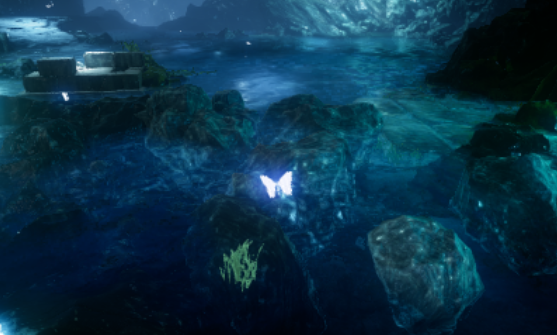

# Engineering-Thesis

Thesis Title: The usage of Unreal Engine & EEG equipment in the process of
visualization of the chosen emotional state in virtual reality

## Technologies:

* UE4
* EEG
* OpenVibe

## General Info

This project combines VR and EEG in UE4 relaxing module.
The scene changes in real time as user relaxation value changes.  
For example - the water change its colour:

## Plugins:

BCI Plugin is included in gitignore file.
You can download it [here](https://www.unrealengine.com/marketplace/braincomputerinterface-ue4plugin).

Assets from this project can be found for free on Epic Games Marketplace. Search for:
* ParticleEffects
* Water Planes
* Blueprints (Butterfly asset)

## Setup

I used Neurosky MindWave Mobile and OpenVibe for EEG data and Oculus Rift (it worked on HTC Vive as well).
Project should work as relaxing module without the BCI plugin, but you won't be able to check your EEG data without it.  
Have a nice day! :)
